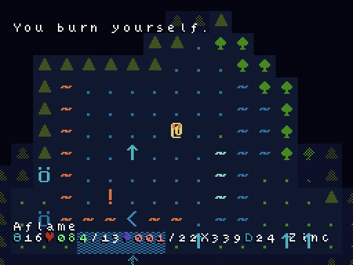
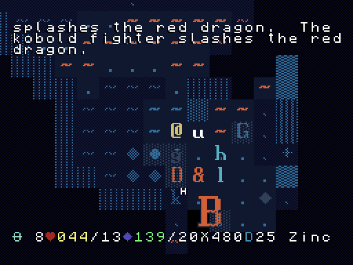

# Terminal Blues: A POWDER Tileset in CP437

## by PropFeds

The Hacklike reimagined in a deep blue terminal aesthetic. Featuring:

- Terrain, monsters and items are entirely within Code Page 437[^1](#footnotes)
(or whatever you call it: extended ASCII, ANSI, etc.)
- (??? Heresy) Spell icons completely in 14px pixel-art
- Custom fonts: A very red Brass, plus two new fonts:
[Blightbulb](extras/lore/blightbulb.md) and [Eclipse](extras/lore/eclipse.md)!
- Questionable colourblind support

## Instructions

**Latest release:**
[1.0.1](https://github.com/PropFeds/terminal-blues/releases/latest) (2019-09-21)

**Latest pre-release:**
[1.1.0-alpha.4](https://github.com/PropFeds/terminal-blues/releases/tag/1.1.0-alpha.4) (2020-01-13)

**Master:** Tileset is contained within `export` folder.

Terminal Blues comes with a few **variants:**

- `blues`: The regular Terminal Blues experience.
- `true_blues`: The three Guardians of the True Blue, who attempt to aid those
with colour deficiencies.
  - `protea`: The guardian of the long cones, now available for testing.
  - `deutzia`: The guardian of the medium cones, extremely in need of testing.
  - `tridude`: The guardian of the short cones, patiently awaiting rare testers.

**Windows, Linux, Mac:**

- Move the `.bmp`s in the desired variant to the `gfx/` subdirectory of your
POWDER installation.
The `.bmp` files should be directly in `gfx/`, not in a subdirectory thereof.
- Optional features: Override in `gfx/` to apply.
  - `equipment`: Will display worn equipment on the @ tile.
  - `extra_alphabets`: Rename to one of the alphabets and override.
- Within POWDER, go to Options > Tiles > From Disk.
- To change the font, head to Options > Fonts.

**Nintendo DS:**

- Same instructions as above, to the `DATA/POWDER/gfx/` directory on the root
of your flash cartridge.
- On startup it should report detecting the tileset, and a new menu option
should show up.

**Gameboy Advance:**
From Jeff Lait,

> The splicebmp program was used to patch a POWDER ROM with these tiles.
> It is no longer supported. GBA users that want a new tileset need to recompile
> from scratch.

**Other Versions:**
You'll need to compile the game with this tileset included.

## Screenshots

> Under Siege (Blightbulb font)

> The Big B (Minecraft font)

> rEkkkT? (Eclipse font)

> Palettes: from left to right,
>
> Blues: v1.1b6
>
> Protea: v0.07
>
> Deutzia: v0.02
>
> Tritoma: v0.02

## Documentation

[Full Changelog](docs/changelog.md)

[Quirks](docs/quirks.md)

[Scripts](docs/scripts.md)

[Tile List](docs/tilelist.md)

## Contact

Whether for feedback or for a simple Internet hug, these are the available
methods of arcane communication:

- Post an issue on GitHub
- The [Roguelikes Discord](https://discord.gg/tJt4kMM), at `#powder`
- My [cult 👀](https://discord.gg/AxMZJyg), at `#slither-dither`

## Licenses

- The `Terminal Blues` tileset is licensed under [**CC-BY-SA 4.0**](license.md).
- Base fonts (alphabets):
  - `brass` and `classic` were derived by Markus Maier from the window's (sic)
  console font, licensed under **CC-BY 3.0**.
  - `shadow` was created by Markus Maier, licensed under **CC-BY 3.0**.
  - `light` and `heavy` were created by PropFeds, and are **unlicensed**.
- Extra fonts (alphabets): Credit goes to their respective designers.
  - `cheepicus` was created by Cheepicus.
  - `ibm_cga_thin` was created by IBM.
  - `minecraft` was created by JD Graphics.
  - `msx` was derived by Zaratustra from the MSX computers.
  - `textmachine_handwriting` was created by Polyducks, licensed under **CSL**.
  [Link](https://polyducks.itch.io/textmachine-handwriting-font)
- Scripts:
  - [`table_persistence`](data/scripts/lua_ase/export/lib/table_persistence.lua)
  was created by Gerhard Roethlin, licensed under **MIT**.
  - Every other script is **unlicensed**.

## Footnotes

[^1]: Though some items have custom textures for ease of identification.
