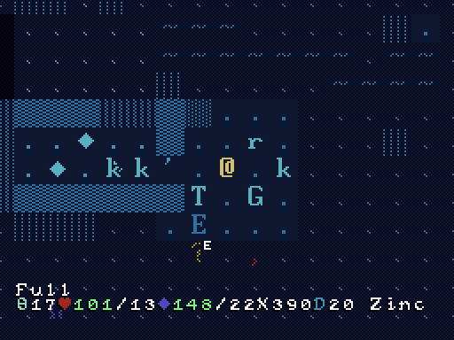

# Terminal Blues: A POWDER Tileset in CP437

## by PropFeds

The Hacklike reimagined in a deep blue terminal aesthetic. Featuring:

- Terrain, monsters and items in Code Page 437/Extended ASCII/ANSI[^1]
- (??? Heresy) Spell icons completely in 14px pixel-art
- Custom fonts: [Blightbulb](docs/lore/blightbulb.md) and [Eclipse](docs/lore/eclipse.md) to replace the [Light and Heavy](docs/quirks.md#my-heavy-and-light-fonts-are-swapped) fonts!
- Questionable colourblind support

## Instructions

Latest release: [1.0.1](https://github.com/PropFeds/terminal-blues/releases/latest)

Latest alpha/beta: [1.1.0-alpha.3](https://github.com/PropFeds/terminal-blues/releases/tag/1.1.0-alpha.3)

Terminal Blues comes with a few variants:

- `blues`: The regular Terminal Blues experience.
- `true_blues`: The three Guardians of the True Blue,
who attempt to aid those with colour deficiencies.
  - `protea`: The guardian of the long cones, now available for testing.
  - `deuterium`: ??
  - `tridude`: ???

On Windows, Mac and Linux versions:

- Create a folder in your POWDER directory named `gfx`.
- Copy the bmps in your desired variant to `gfx`.
- Optional features: Override in `gfx` to apply.
  - `equipment`: Will display worn equipment on the @ tile.
  - `extra_alphabets`: Rename to one of the alphabets and override.
  All external fonts, copyrighted by their respective owners.
    - `cheepicus`: by Cheepicus.
    - `ibm_cga_thin`: thin variant of the IBM CGA font.
    - `minecraft`: by JD Graphics.
    - `msx`: from the MSX machines.
    - `textmachine_handwriting`: by Polyducks.
- Within POWDER, go to Options > Tiles > From Disk.
- Head to Options > Fonts in-game to change the font.

On handheld versions: You'll need to compile the game with this tileset included.

## Screenshots

1.1: Spelling Reform is under construction. Screenshots may not be final!

*Under Siege (Blightbulb font)*

*The Big B*

*Space Odyssey*

*rEkT? (Eclipse font)*

## Documentation

Be noted, markdown (`.md`) documents can be opened in a text editor.

[Full Changelog](docs/changelog.md)

[How Do I Contribute?](docs/contributing.md)

[Quirks](docs/quirks.md)

[Tile List](docs/tilelist.md)

## Contact

Whether for feedback or for a simple Internet hug, these are the ways:

- Post an issue on GitHub
- The [roguelikes Discord](https://discord.gg/tJt4kMM), at `#powder`
- My [development guild](https://discord.gg/AxMZJyg), at `#slither-dither`

### Footnotes

[^1]: Some items have custom textures for ease of identification.
